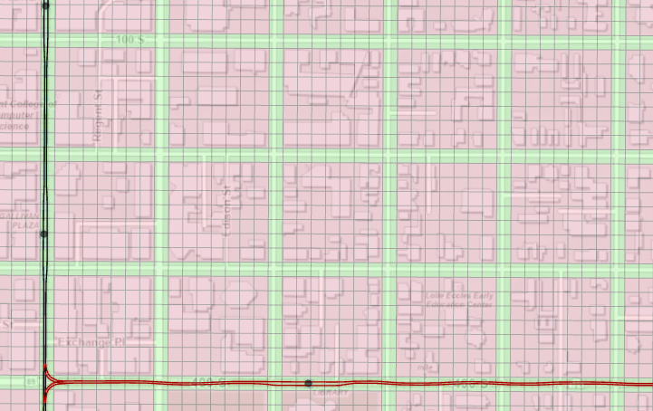
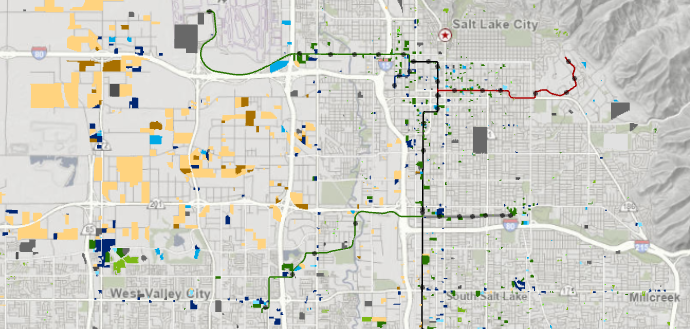

# Identifying Regional Redevelopment Using Assesor Data
*Lilah Rosenfield // WFRC*

## Introduction
Here at WFRC, we maintain a variety of datasets and models intended to support our work guiding the future of transportation and development along the Wasatch Front. One of our models is REMM, or the Real Estate Market Model. We use this tool to predict and identify land use changes throughout our region.

Of course, predicting the future is, by its nature, an uncertain business. For this reason, it's important for us to check our past models against what has actually happened, and identify areas where our model would've failed to accurately predict the future. To do so for REMM, we need to identify areas that have redeveloped over the past several decades in a way that we can compare to our model predictions. This is how we used public data to identify areas of redevelopment, and classify them in ways that our model could understand.

## Process
### Part 0: Data Sources
Fortunately for us, our partners over at UGRC maintain the [Land Information Record (LIR)](https://gis.utah.gov/data/cadastre/parcels/) dataset, which has information on all parcels in every county in Utah.

The first step in the process was to download the latest data for Salt Lake County, and pull it into ArcGIS. We also had an old version of the Salt Lake City dataset from 2007 in our records. For analysis of difference based on other start years (and for analysis on other counties), would would have to find sources for similar "old" LIR datasets.

### Part 1: Importing the Data
To start with, I imported the data for both 2022 and 2007. Quite quickly, I realized this process would not be as simple as spatially comparing the two parcels. In addition to the expected subdivisions and consolidations, it seems that our colleagues in the municipal and county GIS department had refined (read: changed) the shape of many, if not most parcels in the 15 years between the production of the datasets.


<p align=center> <em> Yellow outlines are 2022 parcels, green outlines are 2007 parcels</em></p>

Overall, this is a good thing! The new parcel shapes seem to be much more reflective of what's actually happening on the ground, but it makes direct comparison (with simple logic to handle subdivision/consolidation) basically impossible. Furthermore, while the parcel numbers do seem to have some sort of overlap, the changes are substantial enough that developing a procedure that sufficiently addresses all edge cases could take weeks, and said procedure would likely only be applicable to Salt Lake County's parcel numbering system.

### Part 3: Fishnets!
So what to do? The solution came in the form are ArcGIS's *Create Fishnet* geoprocessing tool. The idea is that instead of identifying what *parcels* have been redeveloped, we're comparing *identical areas*, with each area pulling data from the parcel it overlaps the most.

The question, of course, is how fine to make the fishnet. Ideally, the mesh is fine enough that nearly all parcels are captured by at least one cell, but there are few enough cells that our hardware can manage the geoprocessing in a timely enough manner that iteration & debugging is doable.

Eventually, I settled on each cell being 99 x 99 Square Feet. This roughly aligns with the downtown Salt Lake City street grid, which is `660' + 132' = 792'` and `792/8 = 99`, meaning that every block has `7 x 7 = 49` cells, with a one-cell gap between each block, at least in downtown.


<p align=center> <em> Hello Downtown Salt Lake. You're looking grid-y today!</em></p>

I then did some guess & check calculation to identify the ideal origin location and number of columns and rows which would overlap the grid in downtown and would contain most of the developed areas of Salt Lake County but not create an excessive number of unnecessary cells over largely undeveloped mountainous areas.

```python
acrcpy.management.CreateFishnet(
        out_feature_class='Grid',
        origin_coord="1576405 7472540",
        y_axis_coord="1576365 7463465",
        cell_width=99,
        cell_height=99,
        number_rows=1450,
        number_columns=1100,
        corner_coord=None,
        labels="NO_LABELS",
        template="DEFAULT",
        geometry_type="POLYGON"
    )
```
Where the origin coordinates are provided in feet relative to the origin of `FIPS 4302`, the Utah Central State Plane (NAD83)[^1].

### Part 3.5: Cleaning up Parcels
Many of the feature polygons in the LIR datasets identify rights of way, rather than true salable parcels. Identifying these parcels is relatively easy, as they don't usually have Parcel ID Numbers. Selecting and deleting features where parcel_id is `Null` or `""` was enough to clean up most of these problem features

### Part 4: Spatial Join
Now comes the fun part. I performed two spatial joins using the grid, one on the 2007 data, one on the 2022 data.

The following were the Geoprocessing functions used to create the joined parcels:

#### 2007 Grid
```py
arcpy.analysis.SpatialJoin(
    target_features="Grid_Project",
    join_features="SLCo_Parcels_2007",
    out_feature_class="SLCo_Parcels_2007_Gridded",
    join_operation="JOIN_ONE_TO_ONE",
    join_type="KEEP_ALL",
    field_mapping=#See Below,
    match_option="LARGEST_OVERLAP",
    search_radius=None,
    distance_field_name=""
)
```
with the following field map
<details>
<summary> View Field Map </summary>

```
Shape_Length "Shape_Length" false true true 8 Double 0 0,
First,#,Grid_Project,Shape_Length,-1,-1;

Shape_Area "Shape_Area" false true true 8 Double 0 0,First,#,Grid_Project,Shape_Area,-1,-1;

parcel_id "parcel_id" true true false 14 Text 0 0,First,#,SLCo_Parcels_2007,parcel_id,0,14;

tax_dist "tax_dist" true true false 3 Text 0 0,First,#,SLCo_Parcels_2007,tax_dist,0,3;

property_type_num "property_t" true true false 3 Text 0 0,First,#,SLCo_Parcels_2007,property_type_num,0,3;

parcel_acres "parcel_acr" true true false 8 Double 0 0,First,#,SLCo_Parcels_2007,parcel_acres,-1,-1;

bldg_sqft "SqFt07" true true false 4 Long 0 0,First,#,SLCo_Parcels_2007,bldg_sqft,-1,-1;

unit_cnt "Units07" true true false 4 Long 0 0,First,#,SLCo_Parcels_2007,unit_cnt,-1,-1;

built_yr "YrBuilt07" true true false 2 Short 0 0,First,#,SLCo_Parcels_2007,built_yr,-1,-1;

land_mkt_vaue "LAND_VALUE" true true false 8 Double 0 0,First,#,SLCo_Parcels_2007,land_mkt_vaue,-1,-1;

Shape_Length_1 "Shape_Length" false true true 8 Double 0 0,First,#,SLCo_Parcels_2007,Shape_Length,-1,-1;

Shape_Area_1 "Shape_Area" false true true 8 Double 0 0,First,#,SLCo_Parcels_2007,Shape_Area,-1,-1;

total_mkt_value "total_mkt_value" true true false 8 Double 0 0,First,#,SLCo_Parcels_2007,total_mkt_value,-1,-1
```
</details>

#### 2022 Grid

```py
arcpy.analysis.SpatialJoin(
    target_features="Grid_Project",
    join_features="SLCo_Parcels_2022",
    out_feature_class="SLCo_Parcels_2022_Gridded",
    join_operation="JOIN_ONE_TO_ONE",
    join_type="KEEP_COMMON",
    field_mapping=#See Below,
    match_option="LARGEST_OVERLAP",
    search_radius=None,
    distance_field_name=""
)
```
With the following field map
<details>
<summary> View Field Map </summary>

```
Shape_Length "Shape_Length" false true true 8 Double 0 0,First,#,Grid_Project,Shape_Length,-1,-1;

Shape_Area "Shape_Area" false true true 8 Double 0 0,First,#,Grid_Project,Shape_Area,-1,-1;

parcel_id "parcel_id" true true false 50 Text 0 0,First,#,SLCo_Parcels_2022,parcel_id,0,50;

tax_dist "tax_district" true true false 10 Text 0 0,First,#,SLCo_Parcels_2022,tax_dist,0,10;

total_mkt_value "total_mkt_value" true true false 8 Double 0 0,First,#,SLCo_Parcels_2022,total_mkt_value,-1,-1;

land_mkt_value "land_mkt_value" true true false 8 Double 0 0,First,#,SLCo_Parcels_2022,land_mkt_value,-1,-1;

parcel_acres "parcel_acres" true true false 8 Double 0 0,First,#,SLCo_Parcels_2022,parcel_acres,-1,-1;

unit_cnt "house_cnt" true true false 10 Text 0 0,First,#,SLCo_Parcels_2022,unit_cnt,0,10;

bldg_sqft "bldg_sqft" true true false 8 Double 0 0,First,#,SLCo_Parcels_2022,bldg_sqft,-1,-1;

built_yr "built_yr" true true false 2 Short 0 0,First,#,SLCo_Parcels_2022,built_yr,-1,-1;

property_type_num "prop_type" true true false 100 Text 0 0,First,#,SLCo_Parcels_2022,property_type_num,0,100;

Shape_Length_1 "Shape_Length" false true true 8 Double 0 0,First,#,SLCo_Parcels_2022,Shape_Length,-1,-1;

Shape_Area_1 "Shape_Area" false true true 8 Double 0 0,First,#,SLCo_Parcels_2022,Shape_Area,-1,-1
```
</details>

### Part 5: Preliminary Comparisons
In order to identify areas where changes had occurred, I joined the 2007 and 2022 Gridded Parcels, then classified them by the following three factors:
* Had the parcel been rebuilt or newly built since 2007[^2]
* Were the numerical property types the same?[^3]
* Was the square footage the same? [^4]

Based on these comparisons, I classified each cell according to the following logic (the code for sorting these parcels can be found in property_change_sorter.py)

<!-- To the nerds reading this in raw markdown: my apologies for the width of this chart -->
|Build Status|Same Type              |Same Category          |New Units              |Different Category     |
|------------|-----------------------|-----------------------|-----------------------|-----------------------|
|No Build    |`1` No Build           |`2` No Build (Minor)   |`3` No  Build (Add)    |`4` No Build (Change ) |
|Old Build   |`10` No Change         |`12` Minor type change |`13` Add Units         |`11 (14)` Re-use       |
|Rebuild     |`20 (21)` Rebuild      |`30 (31)` Redevelopment|`30 (31)` Redevelopment|`30 (31)` Redevelopment|
|New Build   |`42` New Build (slated)|`40 (41)` New Build    |`40 (41)` New Build    |`40 (41)` New Build    |

#### Categorization notes
* For the purposes of categorizing change types, cells with the following numerical property types were considered as having the **same type**: 
    * `951, 953, 954` (Government Properties)
    * `711, 116` (Multifamily dwelling)
    * `102, 103, 111, 511, 998` (Single family homes)
    * `592, 593, 594` (Warehouses)
    * `511, 997` (Multifamily residential improvements)
* For the purposes of categorizing changes, cells with the following numerical property types were identified as having the **same category** (but not the same type):
    * All numerical property types that had the same leading digit, except for those categorized under the "new units" logic, described below, and those that are already deemed equivalent as described above.
    * `957, 119, 111`
* A cell was classified as having **new units** in the following case:
    * For categories `111, 112, 113, 114, 115, 120, 150, 199`, if the new category was greater than the old category, a unit upgrade was considered to have occured
    * Category `106` (ADU) is considered equivalent to `112` (Duplex) in the above logic
* In circumstances where reconstruction or new build occurred, but the square footage was listed as the same, an additional flag identifying the cell as having a **potential error** was added.

#### Part 5.1: Expectation Check
The LIR dataset for Salt Lake County contains *a lot* of data, and I manipulated that data, in bulk quite a bit. In order to make sure that everything had gone smoothly, I loaded up the cells in ArcGIS, and symbolized everything with a type change of 11 or greater (that's everything but unbuilt cells and unmodified existing builds, for those of you keeping track at home)
 

<p align=center> <em> Green represents new build, blue redevelopment, and pink type changes.</em></p>

As can be seen in the above image, New Construction is largely concentrated in the southwestern quadrant of Salt Lake County, while redevelopment seems to have concentrated somewhat around Trax lines. This is roughly aligned with expectations and suggests that the processing steps above have produced a map which correlates to the reality on the ground.

One issue of note is just how many cells have been identified as having changed use, especially in the northeast of the valley. Part of the refinement process to identify the equivalent usages described in "categorization notes" was based on identifying the largest categories of re-use and considering if an actual change could've been said to occurred between the two uses. This iterative process managed to identify many cells categorized as having been 're-used' as something else, but nevertheless, approximately `44,000` cells are considered to have changed use without reconstruction.

### Part 6: Categorizing Redevelopment by Use Type
Having identified all cells in which change had occurred, it was time to categorize said changes by identifying how development in the cells is now being used.

REMM splits development into five categories: residential multifamily, residential single family, retail, office and industrial. I felt that dividing these broad categories into subcategories would make the dataset more amenable to qualitative analysis, while still ensuring usability by REMM. For that reason, parcels were assigned the following classes based upon their 2022 numerical classification:

<details>
<summary> View Categorizations </summary>

* `1`: Single Family Homes
    * `103` Res-Obsolesced Value
    * `104` Modular
    * `111` Single Family Res.
    * `118` Manuf. Home
    * `160` Trailer Park
    * `998` SF Res- Model
* `2`: Duplex
   * `106` Res Mother-Law Apt
   * `112` Duplex
* `3`: Multifamily Homes
   * `113` 3‑4 Unit Apt
   * `114` 5‑9 Unit Apt
   * `115` 10‑19 Unit Apt
   * `116` Condo Unit
   * `120` 20‑49 Unit Apt
   * `142` Low-Inc-Hous-TC
   * `150` 50‑98 Unit Apt
   * `199` 99+ Unit Apt
   * `503` Retail Mixed
   * `504` Apt Mixed
   * `510` Comm Imps in Res Zone
   * `511` Res Impr On Comm
   * `699` Condo 99+ Unit Apt
   * `700` Common Area
   * `701` Common Area PUD
   * `711` Condo Comm Master
   * `713` Apt Common Master
   * `997` Residential - Multi
* `9`: Unknown Residential
    * `119` PUD
* `10`: Office
   * `506` Office Conversion
   * `509` Office Mixed
   * `566` Office
   * `660` Condo Office
   * `760` Office Comm Master
   * `916` Associated Office
* `11`: Medical
   * `524` Nursing Hospital
   * `540` Group Care Home
   * `547` Hospital
   * `560` Medical Office
   * `576` Retirement Home
* `20`: Retail
   * `500` Commercial / Other
   * `513` Auto Service Center
   * `514` Auto Dealership
   * `515` Bank
   * `516` Used Car Lot
   * `517` Bowling Alley
   * `518` Car Wash
   * `523` Convenience Store
   * `525` Drug Store
   * `527` Day Care Center
   * `529` Discount Store
   * `536` Mini Lube
   * `537` Service Garage
   * `539` Lounge
   * `548` Hotel - Limited
   * `549` Hotel
   * `553` Health Club
   * `559` Market
   * `561` Mortuary
   * `562` Motel
   * `571` Reception Center
   * `573` Restaurant
   * `574` Fast Food Restaurant
   * `575` Retail Store
   * `581` Neighborhood Ctr
   * `582` Community Mall
   * `583` Regional Mall
   * `584` Retail Service
   * `585` Strip Center
   * `591` Theater
   * `596` Discount Warehouse
   * `649` Condo Hotel
   * `775` Retail Comm Master
* `30`: Industrial
   * `200` Industrial / Other
   * `203` Industrial Mixed
   * `550` Ind - Light - Mfg
   * `552` Ind - RE
   * `554` Ind Heavy Mfg
   * `555` Ind Light Shell
   * `695` Condo Industrial
   * `795` Ind Common Master
   * `811` Agri- Farm Animals
   * `812` Agri- Prod Grain
   * `816` Agri Livestock Ranch
   * `850` Mining
   * `915` Associated Industrial
* `31`: Warehouse
   * `556` Cold Storage
   * `558` Flex
   * `590` Office / Warehouse
   * `592` Distribution Whse
   * `593` Mini Warehouse
   * `594` Storage Warehouse
   * `595` Transit Warehouse
* `40`: Government
   * `951` Public
   * `953` Gov Bldg / Land
   * `954` School
* `41`: Churches
   * `956` Church
* `49`: Other / Unknown
   * `117` Improved Rec.
   * `567` Parking Structure
   * `577` School Private
   * `901` Vacant Lot - Res
   * `902` Vacant Lot - Ind
   * `905` Vacant Land - Comm
   * `911` Vac Residential Lot
   * `913` Vacant Assoc - MH
   * `922` PUD Lot
   * `955` Other Exempt
   * `957` Related Parcel
   * `960` Golf Course
   * `961` Cemetery
   * `990` Other Improvements
</details>

I then symbolized these categorizations in the classic City Builder (a la SimCity or Cities: Skylines) color scheme:


Loading this map into ArcGIS and looking at at the northern portion of the valley (excluding single-family homes) strikingly demonstrates the impact of transportation on land use and redevelopment:



As can be seen, almost all multifamily residential redevelopment is concentrated around fixed route transit, as is most office development. Retail redevelopment tends to cluster around arterials, especially mid-valley, while warehouse and industrial development is almost exclusively found in the northwest quadrant.

Much of the LIR data was kept intact through the conversion process, thus preserving future options for analysis.

## Conclusion:
The goal of this project was to create a rough outline of where redevelopment occurred in Salt Lake County. Because of the inherent messiness of urban change (and of the data), this information should not be taken as definitive for any individual cell, but rather as a starting point which can be compared to model outcomes in aggregate or used qualitatively to discuss patterns of development.

To that end, I hope you found the information in this post useful, and I look forward to seeing further developments in this dataset, both in terms of calculated data and in terms of changes as the Wasatch Front continues to grow. 

[^1]:  Prior to the next step, the grid was re-projected to NAD83 UTM 12N to match the LIR Parcels.

[^2]: I also compared the build dates directly, but found that, for many cells, a slightly different build date before 2007 was present, either as a result of updated information in the LIR dataset, or of different spatial joins. I found that more reliable information could be found by simply identifying what cells had the largest overlap with a parcel built after the comparison year

[^3]: Numerical property type is used to identify the current use of a property for tax purposes. The meaning of each field type can be found [on the Salt Lake County website](https://slco.org/assessor/new/FieldDescriptions/parcelRecord2.html).

[^4]: As we shall see, this comparison was mostly used for quality control purposes.
